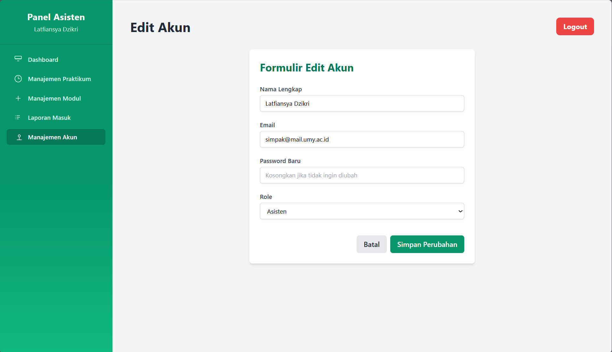
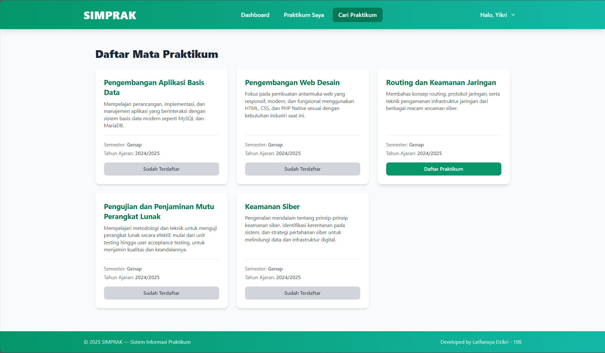

# Proyek Akhir Semester: Sistem Informasi Manajemen Praktikum (SIMPRAK)

Ini adalah proyek akhir untuk mata kuliah **Praktikum Pengembangan Desain Web**. Aplikasi ini dibangun menggunakan PHP Native, MySQL, dan Tailwind CSS.

## Deskripsi Proyek

SIMPRAK adalah sebuah sistem informasi berbasis web yang dirancang untuk mengelola kegiatan praktikum di sebuah institusi pendidikan. Sistem ini memfasilitasi proses pembagian materi, pengumpulan laporan, dan penilaian secara terpadu untuk meningkatkan efisiensi antara asisten dan mahasiswa.

## Teknologi yang Digunakan

* **Backend:** PHP Native
* **Database:** MySQL / MariaDB
* **Frontend:** HTML, Tailwind CSS (via Play CDN)

## Fitur Utama

Aplikasi ini memiliki dua peran utama dengan fungsionalitas masing-masing:

1.  **Asisten (Admin):**
    * CRUD penuh untuk data Mata Praktikum.
    * CRUD penuh untuk data Modul di setiap praktikum (termasuk upload materi).
    * CRUD penuh untuk data Akun Pengguna (Mahasiswa & Asisten).
    * Melihat dan memfilter laporan yang masuk dari mahasiswa.
    * Memberikan nilai dan feedback untuk setiap laporan.
    * Dashboard dinamis yang menampilkan statistik.

2.  **Mahasiswa:**
    * Melihat katalog dan mendaftar ke mata praktikum.
    * Melihat daftar praktikum yang sudah diikuti.
    * Mengunduh materi dan mengumpulkan laporan untuk setiap modul.
    * Melihat nilai dan feedback dari asisten.
    * Dashboard dinamis yang menampilkan rekap progres.

## Tampilan Antarmuka (UI)

Berikut adalah beberapa tangkapan layar dari tampilan aplikasi SIMPRAK.

### Halaman Umum
| Registrasi | Login |
| :---: | :---: |
|  |  |

 

### Halaman Asisten (Admin)
| Dashboard |
| :---: |
|  |

| Manajemen Praktikum | Detail Praktikum |
| :---: | :---: |
|  |  |

| Manajemen Modul | Detail Modul |
| :---: | :---: |
|  |  |

| Laporan Masuk | Detail & Penilaian Laporan |
|  |  |

| Manajemen Akun | Edit Akun |
| :---: | :---: | 
|  |  |

 

### Halaman Mahasiswa
| Dashboard | Katalog Praktikum | Praktikum Saya |
| :---: | :---: | :---: |
|  |  |  |

| Detail Praktikum & Tugas | Detail Praktikum & Tugas (+status pengumpulan) |
| :---: | :---: |
|  |  |